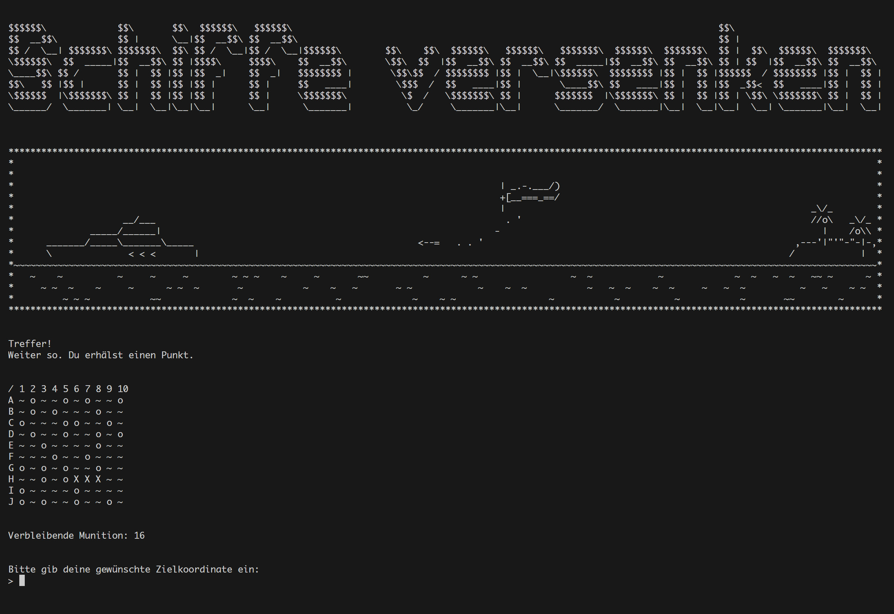

# Miniprojekt zum Abschluss des Moduls "Programming Basics"

## Ziel des Projektes

Dieses kleine Projekt bietet eine Gelegenheit, grundlegende Funktionen von JavaScript und Node.js anzuwenden. Das Mini-Game ist eine Textversion des klassischen Spiels Schiffe versenken und soll dabei helfen, die grundlegenden Programmierskills zu festigen.

## Spielidee

Schiffe versenken - Der Spieler versucht, auf einem Spielfeld versteckte Schiffe zu versenken, indem er gezielt Koordinaten angibt. Für jedes versenkte Schiff gibt es Punkte, aber Vorsicht: Jeder Fehlschuss und jede falsche Eingabe kosten Versuche!

## Spielablauf

#### Spielstart

Der Spieler gibt seinen Namen ein und wird von einem visuellen Intro begrüßt. Die wichtigsten Spielregeln und Grafiken geben einen Überblick.

#### Spielprinzip

Das Spielfeld enthält 3 Schiffe, die zufällig verteilt sind und jeweils aus 3 Feldern bestehen. Diese Felder sind entweder horizontal oder vertikal ausgerichtet.

Treffer werden mit einem `X` markiert, Fehlschüsse mit einem `O`.
Der Spieler hat 50 Versuche.

Ziel: Alle Schiffe mit möglichst wenig Versuchen versenken.

Der Spieler gibt Koordinaten ein, z. B. A1, B5, I10. Falsche Eingaben werden als Fehlschüsse gewertet. Bereits beschossene Felder erneut anzuwählen, kostet ebenfalls einen Versuch.

#### Punkte und Spielende

Für jedes getroffene Schiffssegment wird ein Punkt erzielt. Wenn alle Schiffe versenkt wurden oder die Versuche aufgebraucht sind, endet das Spiel und die Punktzahl wird angezeigt.

## Installation & Start

1. Repository klonen. 
   Stelle sicher, dass du das Repository auf deinen Computer geklont hast.
2. Terminal öffnen
   Öffne dein Terminal und wechsle in den Ordner des Spiels.
3. Pakete installieren
   Führe `npm install` aus, um notwendige Pakete zu installieren.
4. Spiel starten
   Führe das Spiel mit dem Befehl `npm start` aus.
5. Spiel beenden
   Um das Spiel vorzeitig zu beenden, drücke im Terminal `Strg + C`.

## Über mich

Hallo! Ich heiße Andreas Knopf und absolviere derzeit eine einjährige Vollzeit Weiterbildung zum Web- und Softwareentwickler beim Digital Career Institute (DCI). Dieses Projekt ist ein Bestandteil meines Curriculums und setzt den Fokus auf die Anwendung grundlegender Programmierkonzepte.

Da das Projekt in einem frühen Lernabschnitt entstanden ist, war der Einsatz fortgeschrittener Funktionen nicht vorgesehen. Mir ist bewusst, dass dies das Spiel interessanter gemacht hätte, aber der Fokus liegt hier auf den grundlegenden Konzepten.

Viel Spaß beim Spielen und Erkunden!
